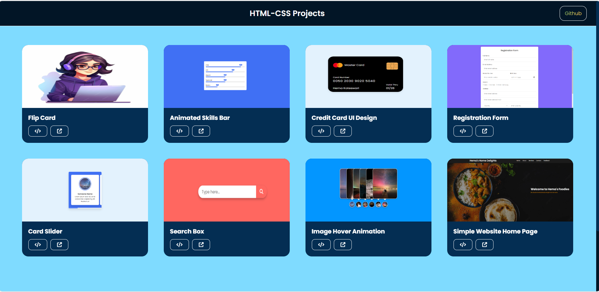

# 🚀 HTML & CSS Mini Projects Website  

Welcome to the **HTML & CSS Mini Projects Website!** 🎨✨  
This website showcases various **mini projects** I created to enhance my front-end development skills. Each project is displayed with an **image preview**, **source code link**, and **live deployment link** for easy access.  

This is part of my continuous journey to master HTML, CSS, and UI/UX design. 🚀  

---

## Why This Project?
I created this project during my internship as part of my journey to learn HTML and CSS. Now, as an experienced developer, I am pushing this code to GitHub to document my progress and preserve my early projects as a reflection of my growth and skills.

## 📌 Overview  

This website is designed to:  
✅ Showcase **each project** with a preview image  
✅ Provide **live deployment links** for direct interaction  
✅ Offer **source code access** for easy learning  
✅ Feature **JS animations** with ScrollReveal for smooth effects  
✅ Ensure **full responsiveness** for all projects  
✅ Include a **Back-to-Top button** for seamless navigation  
✅ Have a **footer with useful resources**  

Built to help beginners explore and learn front-end development in an interactive way! 🌱  

---

## 📸 Screenshots

---

## 🌐 Live Demo

The project is live and can be viewed here: [HTML & CSS Mini Projects Website](https://html-css-projects-phi.vercel.app/)

---

## 🛠 Technologies Used  

- **🌍 HTML5** – Structuring web pages  
- **🎨 CSS3** – Styling, animations, and layouts   
- **🖊️ VS Code** – Primary code editor  
- **🐙 Git & GitHub** – Version control and hosting  

---

## 📂 Projects Listed  

Each project includes:  

📸 **Image Preview** | 📜 **Code Link** | 🔗 **Live Demo**  

---

## 📂 Projects
1. **3D Flip Card** – A 3D card that flips on hover.
2. **Animated Skills Bar** – Skill progress bars with animations.
3. **Credit Card UI Design** – Interactive credit card design.
4. **Registration Form** – Fully functional registration form.
5. **Responsive Card Slider** – Card slider with smooth transitions.
6. **Search Box** – Basic search box UI.
7. **Image Hover Animation** – Hover transition using z-index.
8. **Simple Website** – A clean homepage layout.

---

## ⚙️ Prerequisites  

Before running the projects, ensure you have the following installed:  

- 🖥️ **A modern web browser** (Chrome, Firefox, Edge, etc.)  
- 📝 **VS Code** (or any code editor)  
- 🌐 **Git** (optional, for cloning the repository)  

---

Feel free to explore, use, and modify these projects. If you find them helpful, consider giving this repo a ⭐! 😊
